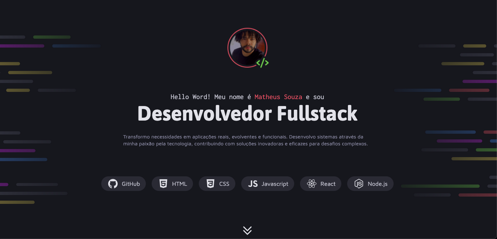

## Desafio: Página de Local Turístico

Este projeto é um desafio proposto pelo curso Fullstack com JavaScript da [`@Rocketseat`](https://rocketseat.com.br). O objetivo é criar uma página que exiba um portfolio dev, utilizando apenas `HTML` e `CSS`.



<table align="center">
<tr>
  <td><a href="https://www.figma.com/community/file/1387080701963671866/portfolio-dev">Acesse o <strong>link</strong> do Figma aqui</a></td>
</tr>
</table>

## Objetivos do Projeto
- **CSS Flexbox:** ara criar layouts flexíveis e responsivos.
- **Posicionamento de Elementos:** Utilizando propriedades como position, top, left, right, bottom, z-index, etc.
- **CSS Grid:** Para criar layouts complexos e alinhamentos precisos.
- **Variáveis CSS:** Para facilitar a manutenção e consistência do código.
- **Pseudo-classes e Pseudo-elementos:** Para estilizar elementos de forma dinâmica e adicionar conteúdo extra.
- **Estilização com CSS:** Criar estilos personalizados para tornar a página visualmente atraente e responsiva.

## Tecnologias
- **HTML:** Para a estruturação do conteúdo da página.
- **CSS:** Para a estilização e design da página.

## Como Executar o Projeto

1. Clone este repositório:
```bash
git clone https://github.com/matheussouza4/portfolio-dev.git
```
2. Navegue até a pasta do projeto:
```bash
cd portfolio-dev
```
3. Abra o arquivo index.html no seu navegador para visualizar a página.

### Estrutura do Projeto

- **index.html:** Arquivo principal que contém a estrutura HTML da página.

- **styles/:** Pasta que contém o arquivo CSS para estilização da página.

- **assets/:** Pasta que contém as imagens e outros recursos utilizados na página.
